<!--
████████████████████████████████████████████████
  PRANAVD53 · GITHUB PROFILE README
████████████████████████████████████████████████
-->

<div align="center">


</div>

---

<div align="center">

<!-- ════════════════════════════════════════════════════════════
     PIXEL HERO BANNER
     SVG file hosted in the same repo → GitHub renders with
     full CSS animations. No raw code leaks into the page.
════════════════════════════════════════════════════════════ -->



</div>

---

<div align="center">


</div>

---

## 🎮 CHARACTER SELECT

```
╔══════════════════════════════════════════════════════╗
║              🎮  CHARACTER SELECT                    ║
╠══════════════════════════════════════════════════════╣
║  🕹️  PLAYER    :  PRANAV D                          ║
║  🕷️  CLASS     :  Full-Stack Web Dev                ║
║  🏴‍☠️  QUEST     :  Find the One Piece of Open Source ║
║  🥊  TRAINING  :  One Commit at a Time              ║
║  ⭐  SPECIAL   :  Turning Ideas Into Reality        ║
╚══════════════════════════════════════════════════════╝
```

---

## ⚡ SKILL TREE

<div align="center">


</div>

---

## 🎮 XP PROGRESS

```
🕷️  Web Dev          ████████████████████  ∞ XP   (Web-Slinger Level)
🏴‍☠️  Open Source      ██████████████████░░  90 XP  (Future King Arc)
🥊  Algorithms       ████████████████████  ∞ XP   (Dempsey Roll Unlocked)
🤖  Machine Learning ████████████████░░░░  80 XP  (Grand Line Region)
🐳  DevOps           ████████████░░░░░░░░  60 XP  (Garp Training Arc)
🧠  System Design    ██████████████░░░░░░  70 XP  (Sea Floor Gravity)
```

---

## 📊 BATTLE STATS

<div align="center">

<a href="https://github.com/PranavD53">
  
</a>
<a href="https://github.com/PranavD53">
  
</a>

</div>

<div align="center">

[](https://git.io/streak-stats)

</div>

---

## 🕷️ THE SPIDER VERSE — Web Dev Philosophy

```
╔══════════════════════════════════════════════════╗
║  🕸️  Swinging between Frontend & Backend        ║
║  🕷️  Catching bugs before they reach production  ║
║  ⚡  "With great code comes great responsibility"║
╚══════════════════════════════════════════════════╝
```

- 🌐 Building scalable web applications end-to-end
- 🤖 Crafting AI/ML integrations that actually work
- 🧪 Testing everything — no bug escapes the web
- 🚀 Shipping products that make an impact

---

## 🏴‍☠️ THE GRAND LINE — Open Source Quest

```
╔══════════════════════════════════════════════════╗
║  🏴‍☠️  DREAM    :  King of Open Source            ║
║  🗺️  CURRENT  :  East Blue → Grand Line Arc      ║
║  💎  TREASURE :  Knowledge & Collaboration       ║
║  ⚓  CREW     :  Devs across the globe           ║
╚══════════════════════════════════════════════════╝
```

- 📦 Contributing to open-source projects
- 🧠 Mastering system design & architecture
- 🌍 Collaborating with global developer crews
- 🏆 Building projects that outlive the arc

---

## 🥊 THE TRAINING ARC — Hajime no Code

```
╔══════════════════════════════════════════════════╗
║  🥊  Every commit is another punch.             ║
║  🏃  Consistency beats talent.                  ║
║  🔥  Progress is built round by round.          ║
║  💪  Dempsey Roll = Momentum Compound Learning  ║
╚══════════════════════════════════════════════════╝
```

- 💻 Daily practice — roadwork never stops
- 📘 One new technology per arc
- 🔥 Maintaining commit streaks like Ippo's stamina
- 🧩 Problem-solving is the jab; shipping is the cross

---

## 🏆 BOSS BATTLES (Featured Projects)

| 🎮 Project | 🕹️ Description | ⚡ Stack |
|---|---|---|
| 🕷️ **[Air-Draw-Pro](https://github.com/PranavD53/Air-Draw-Pro)** | AI-powered air gesture drawing | Python, CV |
| 🏴‍☠️ **[Portfolio](https://github.com/PranavD53/Portfolio)** | Personal portfolio web voyage | JavaScript |
| 🥊 **[100 Days 100 Projects](https://github.com/PranavD53/100DAYS_OF_100WEBPROJECTS)** | Frontend training arc — 1 project/day | HTML, CSS, JS |

---

## 🗺️ ADVENTURE MAP (Contributions)

<div align="center">

[](https://github.com/PranavD53)

</div>

---

## 🌐 CONNECT WITH THE CREW

<div align="center">

[](https://github.com/PranavD53)
[](https://www.linkedin.com/in/sricharanpranav-doddasomayajulu-49b516241)
[](https://spdportfo.netlify.app)
[](mailto:sricharanpranav1@gmail.com)

</div>

---

<div align="center">

```
┌─────────────────────────────────────────────────────────────────┐
│  🕷️  "With great code comes great responsibility."             │
│  🏴‍☠️  "I don't want to conquer anything. I just think the      │
│        person with the most freedom in life is the winner."     │
│  🥊  "No matter how hard or impossible it is, never lose       │
│        sight of your goal." — Makunouchi Ippo                  │
└─────────────────────────────────────────────────────────────────┘
```


```
████████████████████████████████████████████████████████████
█          🎮 GAME SAVED — Thanks for visiting!            █
█     Swinging Through Code • Sailing Toward Dreams        █
█               Training One Commit at a Time              █
████████████████████████████████████████████████████████████
```

</div>
